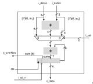

## Sum accumulator

### RTL Describes the following schematic:

### Testplan contains 7 TCs
- TC001: Constant input with selector in 2
- TC002: Constant input with selector in 0
- TC003: Constant input with selector in 1
- TC004: Constant input with selector in 1 and both data in 1
- TC005: Changing input with same selector
- TC006: Changing all inputs
- TC007: Reset and recovery
